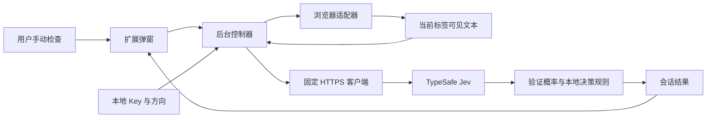

# 架构与浏览器扩展计划

## 数据流

## 模块职责

| 模块 | 输入 → 输出 | 边界 |
| --- | --- | --- |
| `src/core/evaluation.js` | 账号方向、正文 → 五个 Noul 问题；有效概率 → 结论 | 无浏览器、存储或网络依赖 |
| `src/core/client.js` | 用户 Key、方向、正文 → 验证后的概率与结论 | 单次固定 HTTPS 请求，22 秒超时，不记录响应正文 |
| `src/core/errors.js` | 已知错误码 → 安全中文提示 | 不展示服务商响应中的潜在隐私 |
| `src/browser/extract.js` | 当前页 DOM/选区 → 有限长度的纯文本 | 自包含注入函数；跳过隐藏、表单、可编辑及导航节点 |
| `src/browser/platform.js` | WebExtension API → Promise 形式的平台端口 | 所有 storage/tabs/scripting API 集中于此 |
| `src/browser/controller.js` | 可信消息、平台端口 → 公开状态 | 保存/删除/开始/完成串行化，最多一个进行中的检查 |
| `src/browser/background.js` | 打包 UI 的消息 → 控制器 | 校验扩展 ID 和发送页；拒绝内容脚本及外部来源 |
| `src/ui/` | 用户操作、去除密钥的状态 → DOM | 只用 textContent 渲染外部文字；不直接访问 Key 或 API |
| `scripts/build.mjs` | 源文件 → `dist/chrome` | 无远程脚本、环境变量注入或 source map |

新代码包含文件级目的、输入输出及职责边界注释。核心可在 Node 中独立测试，控制器通过注入平台端口测试；无需模拟全部浏览器实现。

## 判断规则

使用五个独立 Noul，置于同一个请求。每个问题都明确引用用户方向与页面文本，且标记页面为不可信证据。指令不能保证模型永不受提示注入影响，但应用不会执行任意模型输出，严格校验五个数字在 `[0,1]` 范围内。

1. 上下文充分概率低于 `0.7`，或者提取截断/回退到整页：复核。
2. 否则，边界冲突高于 `0.7`：不建议。
3. 否则，主题/受众/表达任一项低于 `0.3`：不建议。
4. 否则，边界冲突在 `[0.3, 0.7]`，或者主题/受众/表达任一项在 `[0.3, 0.7]`：复核。
5. 其余：适合转发。

不使用加权平均来抵消明确冲突。初始阈值是产品默认值；采集用户主动提供且获准用于评估的正反例后，才能谈实际质量和校准。第一版不收集这些样本。

## 生命周期

API 调用在 service worker 中进行，弹窗关闭不主动取消。弹窗开启后读取会话结果；进行中时每 700ms 查询状态，不额外发起 Jev 请求。双击复用同一个任务，其他标签并发检查会提示等待。

配置修改/删除、目标标签导航或关闭时中止请求、清除结果，并通过检查 ID 防止旧响应写回。读取结果时校验配置版本、标签 ID 和 URL 摘要；不持久化完整 URL。超过 30 秒仍显示运行中的记录视为中断。目标页面内的异步内容变化不自动扫描；用户需要主动重新检查。

## 跨浏览器

| 平台 | 第一版状态 | 扩展方式 |
| --- | --- | --- |
| Chrome | 交付目标，Manifest V3；最低声明 120 | 使用本构建与自动回归 |
| Edge / Chromium 系浏览器 | 同包候选，未做 Edge 专项验证 | 加载 `dist/chrome`；补目标浏览器版本回归、商店信息 |
| Firefox | 架构预留，未交付安装包 | 新增目标 manifest、background scripts 构建，验证 `browser.*` Promise、session 存储与访问隔离差异，配置 AMO 所需声明 |
| Safari | 架构预留，未交付原生包装 | 用 Safari Web Extension 包装；单独处理 Xcode、签名、权限和生命周期兼容性 |

迁移时保持 core 与判断规则共享，优先更换 platform 端口和构建 manifest。若某浏览器无法提供可信上下文的存储隔离，不得静默降级后声称隐私保证相同，应实现后台专有存储适配再验证。构建与文档不宣称尚未完成的跨浏览器兼容性。

后续可加入每站点正文适配器，先保留通用提取及选区入口；不需要为了潜在扩容提前引入后台服务器、账户系统或宽泛站点权限。
